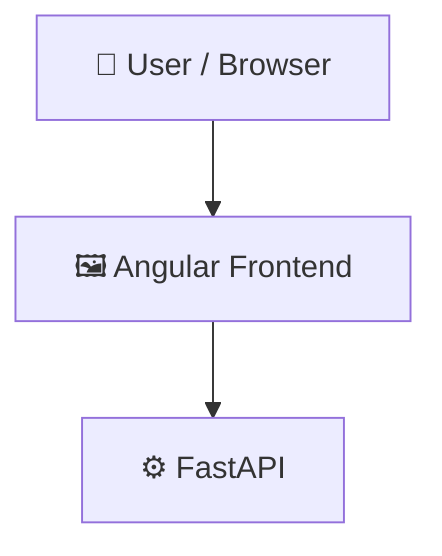

# Stonks

          

## 📑 Table of Contents

- [Description](#description)
- [Screenshots](#screenshots)
- [Tech Stack](#tech-stack)
- [Architecture](#architecture)
- [Quick Start](#quick-start)
- [Key Dependencies](#key-dependencies)
- [Available Scripts](#available-scripts)
- [Project Structure](#project-structure)
- [Development Setup](#development-setup)
- [Deployment](#deployment)
- [Contributors](#contributors)
- [Contributing](#contributing)
- [License](#license)

## 📝 Description

Stonks — a backend api built with Angular, Docker, FastAPI, Python, Tailwind CSS, TypeScript.

## 📸 Screenshots


## 🛠️ Tech Stack

- 🅰️ **Angular**
- 🐳 **Docker**
- ⚡ **FastAPI**
- 🐍 **Python**
- 🌬️ **Tailwind CSS**
- 📘 **TypeScript**

**Notable libraries:** NumPy, Pandas, PyTorch/TensorFlow, Uvicorn

## 🏗️ Architecture

A high-level view of how the main pieces fit together:



## ⚡ Quick Start

```bash

# 1. Clone the repository
git clone https://github.com/MustafaErenTugcu/Stonks.git

# 2. Install dependencies
npm install

# 3. Start the dev server
npm run start
```

## 📦 Key Dependencies

```
@angular/animations: ^15.2.0
@angular/cdk: ^15.2.9
@angular/common: ^15.2.0
@angular/compiler: ^15.2.0
@angular/core: ^15.2.0
@angular/forms: ^15.2.0
@angular/material: ^15.2.9
@angular/platform-browser: ^15.2.0
@angular/platform-browser-dynamic: ^15.2.0
@angular/router: ^15.2.0
chart.js: ^4.4.8
primeicons: ^5.0.0
primeng: ^15.4.1
rxjs: ~7.8.0
tslib: ^2.3.0
```

## 🚀 Available Scripts

- **ng** — `npm run ng`
- **start** — `npm run start`
- **build** — `npm run build`
- **watch** — `npm run watch`
- **test** — `npm run test`

## 📁 Project Structure

```
.
├── BorsaTakip
│   ├── Dockerfile
│   ├── angular.json
│   ├── nginx.conf
│   ├── package.json
│   ├── postcss.config.js
│   ├── src
│   │   ├── app
│   │   │   ├── app-routing.module.ts
│   │   │   ├── app.component.css
│   │   │   ├── app.component.html
│   │   │   ├── app.component.ts
│   │   │   ├── app.module.ts
│   │   │   ├── auth
│   │   │   │   ├── login
│   │   │   │   │   └── ...
│   │   │   │   └── register
│   │   │   │       └── ...
│   │   │   ├── borsa-takip
│   │   │   │   ├── borsa-takip.component.css
│   │   │   │   ├── borsa-takip.component.html
│   │   │   │   └── borsa-takip.component.ts
│   │   │   ├── compare
│   │   │   │   ├── compare.component.css
│   │   │   │   ├── compare.component.html
│   │   │   │   └── compare.component.ts
│   │   │   ├── contact
│   │   │   │   ├── contact.component.css
│   │   │   │   ├── contact.component.html
│   │   │   │   └── contact.component.ts
│   │   │   ├── highlights
│   │   │   │   ├── highlights.component.css
│   │   │   │   ├── highlights.component.html
│   │   │   │   └── highlights.component.ts
│   │   │   ├── interfaces
│   │   │   │   ├── one-cikanlar.ts
│   │   │   │   ├── stock-data.ts
│   │   │   │   └── yatirim-tavsiyesi.ts
│   │   │   ├── market
│   │   │   │   ├── market.component.css
│   │   │   │   ├── market.component.html
│   │   │   │   └── market.component.ts
│   │   │   ├── radar
│   │   │   │   ├── radar.component.css
│   │   │   │   ├── radar.component.html
│   │   │   │   └── radar.component.ts
│   │   │   ├── services
│   │   │   │   ├── auth.service.ts
│   │   │   │   ├── compare.service.ts
│   │   │   │   ├── highlights.service.ts
│   │   │   │   ├── homepage.service.ts
│   │   │   │   ├── radar.service.ts
│   │   │   │   └── stock.service.ts
│   │   │   └── stocks
│   │   │       ├── stocks.component.css
│   │   │       ├── stocks.component.html
│   │   │       └── stocks.component.ts
│   │   ├── assets
│   │   │   └── logos
│   │   │       ├── 005930.KS.png
│   │   │       ├── 0700.HK.png
│   │   │       ├── 3993.HK.png
│   │   │       ├── 5401.T.png
│   │   │       ├── 5411.T.png
│   │   │       ├── 600111.SS.png
│   │   │       ├── 6758.T.png
│   │   │       ├── AAL.L.png
│   │   │       ├── AAPL.png
│   │   │       ├── ABBV.png
│   │   │       ├── ABNB.png
│   │   │       ├── ADBE.png
│   │   │       ├── AKS.png
│   │   │       ├── AMZN.png
│   │   │       ├── ANTO.L.png
│   │   │       ├── AZN.png
│   │   │       ├── BABA.png
│   │   │       ├── BBY.png
│   │   │       ├── BHP.png
│   │   │       ├── BIDU.png
│   │   │       ├── BMW.DE.png
│   │   │       ├── BP.png
│   │   │       ├── BYTEDANCE.png
│   │   │       ├── CLF.png
│   │   │       ├── COIN.png
│   │   │       ├── COP.png
│   │   │       ├── COST.png
│   │   │       ├── CRM.png
│   │   │       ├── CVS.png
│   │   │       ├── CVX.png
│   │   │       ├── DAI.DE.png
│   │   │       ├── DASH.png
│   │   │       ├── DD.png
│   │   │       ├── E.png
│   │   │       ├── EBAY.png
│   │   │       ├── EMR.png
│   │   │       ├── EQNR.png
│   │   │       ├── F.png
│   │   │       ├── FCX.png
│   │   │       ├── FM.TO.png
│   │   │       ├── GAZP.ME.png
│   │   │       ├── GE.png
│   │   │       ├── GLEN.L.png
│   │   │       ├── GM.png
│   │   │       ├── GOLD.png
│   │   │       ├── GOOGL.png
│   │   │       ├── GSK.png
│   │   │       ├── HD.png
│   │   │       ├── HOOD.png
│   │   │       ├── IBM.png
│   │   │       ├── INTC.png
│   │   │       ├── JNJ.png
│   │   │       ├── LNKD.png
│   │   │       ├── LOW.png
│   │   │       ├── LYFT.png
│   │   │       ├── META.png
│   │   │       ├── MMM.png
│   │   │       ├── MRK.png
│   │   │       ├── MRNA.png
│   │   │       ├── MSFT.png
│   │   │       ├── MT.png
│   │   │       ├── NEM.png
│   │   │       ├── NFLX.png
│   │   │       ├── NUE.png
│   │   │       ├── NVDA.png
│   │   │       ├── NVS.png
│   │   │       ├── ORCL.png
│   │   │       ├── PBR.png
│   │   │       ├── PFE.png
│   │   │       ├── PINS.png
│   │   │       ├── PYPL.png
│   │   │       ├── REP.MC.png
│   │   │       ├── RIO.png
│   │   │       ├── ROG.SW.png
│   │   │       ├── ROK.png
│   │   │       ├── ROSN.ME.png
│   │   │       ├── SAN.PA.png
│   │   │       ├── SCCO.png
│   │   │       ├── SHEL.png
│   │   │       ├── SHOP.png
│   │   │       ├── SNAP.png
│   │   │       ├── SPOT.png
│   │   │       ├── SQ.png
│   │   │       ├── STLD.png
│   │   │       ├── STRIPE.png
│   │   │       ├── TATASTEEL.NS.png
│   │   │       ├── TECK.png
│   │   │       ├── TGT.png
│   │   │       ├── TKAG.DE.png
│   │   │       ├── TOT.png
│   │   │       ├── TSLA.png
│   │   │       ├── TWTR.png
│   │   │       ├── UBER.png
│   │   │       ├── VALE.png
│   │   │       ├── VOW3.DE.png
│   │   │       ├── WBA.png
│   │   │       ├── WMT.png
│   │   │       ├── X.png
│   │   │       ├── XOM.png
│   │   │       └── ZM.png
│   │   ├── favicon.ico
│   │   ├── index.html
│   │   ├── main.ts
│   │   └── styles.css
│   ├── tailwind.config.js
│   ├── tsconfig.app.json
│   ├── tsconfig.json
│   └── tsconfig.spec.json
├── BorsaTakipBackend
│   ├── Dockerfile
│   ├── main.py
│   ├── models
│   │   ├── 000270.KS_lstm.h5
│   │   ├── 000270.KS_scaler.save
│   │   ├── 005380.KS_lstm.h5
│   │   ├── 005380.KS_scaler.save
│   │   ├── 005930.KS_lstm.h5
│   │   ├── 005930.KS_scaler.save
│   │   ├── 051910.KS_lstm.h5
│   │   ├── 051910.KS_scaler.save
│   │   ├── 066570.KS_lstm.h5
│   │   ├── 066570.KS_scaler.save
│   │   ├── 0700.HK_lstm.h5
│   │   ├── 0700.HK_scaler.save
│   │   ├── 096770.KS_lstm.h5
│   │   ├── 096770.KS_scaler.save
│   │   ├── 1301.TW_lstm.h5
│   │   ├── 1301.TW_scaler.save
│   │   ├── 2010.SR_lstm.h5
│   │   ├── 2010.SR_scaler.save
│   │   ├── 3402.T_lstm.h5
│   │   ├── 3402.T_scaler.save
│   │   ├── 3407.T_lstm.h5
│   │   ├── 3407.T_scaler.save
│   │   ├── 3993.HK_lstm.h5
│   │   ├── 3993.HK_scaler.save
│   │   ├── 4005.T_lstm.h5
│   │   ├── 4005.T_scaler.save
│   │   ├── 4188.T_lstm.h5
│   │   ├── 4188.T_scaler.save
│   │   ├── 5401.T_lstm.h5
│   │   ├── 5401.T_scaler.save
│   │   ├── 5411.T_lstm.h5
│   │   ├── 5411.T_scaler.save
│   │   ├── 600111.SS_lstm.h5
│   │   ├── 600111.SS_scaler.save
│   │   ├── 6501.T_lstm.h5
│   │   ├── 6501.T_scaler.save
│   │   ├── 6701.T_lstm.h5
│   │   ├── 6701.T_scaler.save
│   │   ├── 6702.T_lstm.h5
│   │   ├── 6702.T_scaler.save
│   │   ├── 6752.T_lstm.h5
│   │   ├── 6752.T_scaler.save
│   │   ├── 6753.T_lstm.h5
│   │   ├── 6753.T_scaler.save
│   │   ├── 6758.T_lstm.h5
│   │   ├── 6758.T_scaler.save
│   │   ├── AAL.L_lstm.h5
│   │   ├── AAL.L_scaler.save
│   │   ├── AAPL_lstm.h5
│   │   ├── AAPL_scaler.save
│   │   ├── ABBV_lstm.h5
│   │   ├── ABBV_scaler.save
│   │   ├── ABNB_lstm.h5
│   │   ├── ABNB_scaler.save
│   │   ├── ADBE_lstm.h5
│   │   ├── ADBE_scaler.save
│   │   ├── AMZN_lstm.h5
│   │   ├── AMZN_scaler.save
│   │   ├── ANTO.L_lstm.h5
│   │   ├── ANTO.L_scaler.save
│   │   ├── AZN_lstm.h5
│   │   ├── AZN_scaler.save
│   │   ├── BABA_lstm.h5
│   │   ├── BABA_scaler.save
│   │   ├── BAS.DE_lstm.h5
│   │   ├── BAS.DE_scaler.save
│   │   ├── BBY_lstm.h5
│   │   ├── BBY_scaler.save
│   │   ├── BHP_lstm.h5
│   │   ├── BHP_scaler.save
│   │   ├── BIDU_lstm.h5
│   │   ├── BIDU_scaler.save
│   │   ├── BMW.DE_lstm.h5
│   │   ├── BMW.DE_scaler.save
│   │   ├── BMY_lstm.h5
│   │   ├── BMY_scaler.save
│   │   ├── BOSCHLTD.NS_lstm.h5
│   │   ├── BOSCHLTD.NS_scaler.save
│   │   ├── BP_lstm.h5
│   │   ├── BP_scaler.save
│   │   ├── CLF_lstm.h5
│   │   ├── CLF_scaler.save
│   │   ├── COIN_lstm.h5
│   │   ├── COIN_scaler.save
│   │   ├── COP_lstm.h5
│   │   ├── COP_scaler.save
│   │   ├── COST_lstm.h5
│   │   ├── COST_scaler.save
│   │   ├── CRM_lstm.h5
│   │   ├── CRM_scaler.save
│   │   ├── CVS_lstm.h5
│   │   ├── CVS_scaler.save
│   │   ├── CVX_lstm.h5
│   │   ├── CVX_scaler.save
│   │   ├── DASH_lstm.h5
│   │   ├── DASH_scaler.save
│   │   ├── DD_lstm.h5
│   │   ├── DD_scaler.save
│   │   ├── DOW_lstm.h5
│   │   ├── DOW_scaler.save
│   │   ├── EBAY_lstm.h5
│   │   ├── EBAY_scaler.save
│   │   ├── EMR_lstm.h5
│   │   ├── EMR_scaler.save
│   │   ├── EQNR_lstm.h5
│   │   ├── EQNR_scaler.save
│   │   ├── E_lstm.h5
│   │   ├── E_scaler.save
│   │   ├── FCX_lstm.h5
│   │   ├── FCX_scaler.save
│   │   ├── FM.TO_lstm.h5
│   │   ├── FM.TO_scaler.save
│   │   ├── FUJHY_lstm.h5
│   │   ├── FUJHY_scaler.save
│   │   ├── F_lstm.h5
│   │   ├── F_scaler.save
│   │   ├── GE_lstm.h5
│   │   ├── GE_scaler.save
│   │   ├── GLEN.L_lstm.h5
│   │   ├── GLEN.L_scaler.save
│   │   ├── GM_lstm.h5
│   │   ├── GM_scaler.save
│   │   ├── GOLD_lstm.h5
│   │   ├── GOLD_scaler.save
│   │   ├── GOOGL_lstm.h5
│   │   ├── GOOGL_scaler.save
│   │   ├── GSK_lstm.h5
│   │   ├── GSK_scaler.save
│   │   ├── HD_lstm.h5
│   │   ├── HD_scaler.save
│   │   ├── HMC_lstm.h5
│   │   ├── HMC_scaler.save
│   │   ├── HON_lstm.h5
│   │   ├── HON_scaler.save
│   │   ├── HOOD_lstm.h5
│   │   ├── HOOD_scaler.save
│   │   ├── IBM_lstm.h5
│   │   ├── IBM_scaler.save
│   │   ├── INTC_lstm.h5
│   │   ├── INTC_scaler.save
│   │   ├── JNJ_lstm.h5
│   │   ├── JNJ_scaler.save
│   │   ├── LOW_lstm.h5
│   │   ├── LOW_scaler.save
│   │   ├── LYB_lstm.h5
│   │   ├── LYB_scaler.save
│   │   ├── LYFT_lstm.h5
│   │   ├── LYFT_scaler.save
│   │   ├── META_lstm.h5
│   │   ├── META_scaler.save
│   │   ├── MMM_lstm.h5
│   │   ├── MMM_scaler.save
│   │   ├── MRK_lstm.h5
│   │   ├── MRK_scaler.save
│   │   ├── MRNA_lstm.h5
│   │   ├── MRNA_scaler.save
│   │   ├── MSFT_lstm.h5
│   │   ├── MSFT_scaler.save
│   │   ├── MT_lstm.h5
│   │   ├── MT_scaler.save
│   │   ├── MZDAY_lstm.h5
│   │   ├── MZDAY_scaler.save
│   │   ├── NEM_lstm.h5
│   │   ├── NEM_scaler.save
│   │   ├── NFLX_lstm.h5
│   │   ├── NFLX_scaler.save
│   │   ├── NINOY_lstm.h5
│   │   ├── NINOY_scaler.save
│   │   ├── NSANY_lstm.h5
│   │   ├── NSANY_scaler.save
│   │   ├── NUE_lstm.h5
│   │   ├── NUE_scaler.save
│   │   ├── NVDA_lstm.h5
│   │   ├── NVDA_scaler.save
│   │   ├── NVS_lstm.h5
│   │   ├── NVS_scaler.save
│   │   ├── ORCL_lstm.h5
│   │   ├── ORCL_scaler.save
│   │   ├── PBR_lstm.h5
│   │   ├── PBR_scaler.save
│   │   ├── PFE_lstm.h5
│   │   ├── PFE_scaler.save
│   │   ├── PHIA.AS_lstm.h5
│   │   ├── PHIA.AS_scaler.save
│   │   ├── PINS_lstm.h5
│   │   ├── PINS_scaler.save
│   │   ├── PYPL_lstm.h5
│   │   ├── PYPL_scaler.save
│   │   ├── REP.MC_lstm.h5
│   │   ├── REP.MC_scaler.save
│   │   ├── RICOY_lstm.h5
│   │   ├── RICOY_scaler.save
│   │   ├── RIO_lstm.h5
│   │   ├── RIO_scaler.save
│   │   ├── ROG.SW_lstm.h5
│   │   ├── ROG.SW_scaler.save
│   │   ├── ROK_lstm.h5
│   │   ├── ROK_scaler.save
│   │   ├── SAN.PA_lstm.h5
│   │   ├── SAN.PA_scaler.save
│   │   ├── SCCO_lstm.h5
│   │   ├── SCCO_scaler.save
│   │   ├── SHEL_lstm.h5
│   │   ├── SHEL_scaler.save
│   │   ├── SHOP_lstm.h5
│   │   ├── SHOP_scaler.save
│   │   ├── SIE.DE_lstm.h5
│   │   ├── SIE.DE_scaler.save
│   │   ├── SNAP_lstm.h5
│   │   ├── SNAP_scaler.save
│   │   ├── SNOW_lstm.h5
│   │   ├── SNOW_scaler.save
│   │   ├── SPOT_lstm.h5
│   │   ├── SPOT_scaler.save
│   │   ├── STLD_lstm.h5
│   │   ├── STLD_scaler.save
│   │   ├── SU.PA_lstm.h5
│   │   ├── SU.PA_scaler.save
│   │   ├── TATASTEEL.NS_lstm.h5
│   │   ├── TATASTEEL.NS_scaler.save
│   │   ├── TECK_lstm.h5
│   │   ├── TECK_scaler.save
│   │   ├── TGT_lstm.h5
│   │   ├── TGT_scaler.save
│   │   ├── TM_lstm.h5
│   │   ├── TM_scaler.save
│   │   ├── TSLA_lstm.h5
│   │   ├── TSLA_scaler.save
│   │   ├── UBER_lstm.h5
│   │   ├── UBER_scaler.save
│   │   ├── VALE_lstm.h5
│   │   ├── VALE_scaler.save
│   │   ├── VOW3.DE_lstm.h5
│   │   ├── VOW3.DE_scaler.save
│   │   ├── WBA_lstm.h5
│   │   ├── WBA_scaler.save
│   │   ├── WMT_lstm.h5
│   │   ├── WMT_scaler.save
│   │   ├── XOM_lstm.h5
│   │   ├── XOM_scaler.save
│   │   ├── X_lstm.h5
│   │   ├── X_scaler.save
│   │   ├── ZM_lstm.h5
│   │   └── ZM_scaler.save
│   ├── requirements.txt
│   └── stonks.db
├── LICENSE
└── docker-compose.yml
```

## 🛠️ Development Setup

### Node.js / JavaScript
1. Install Node.js (v18+ recommended)
2. Install dependencies: `npm install` (or `yarn` / `pnpm install` / `bun install`)
3. Start the dev server: see the **Quick Start** above

### Python
1. Install Python (v3.10+ recommended)
2. `python -m venv venv && source venv/bin/activate`  (Windows: `venv\Scripts\activate`)
3. `pip install -r requirements.txt`

### Docker
1. `docker build -t my-app .`
2. `docker run -p 3000:3000 my-app`

## 🚢 Deployment

### Docker
```bash
docker build -t stonks .
docker run -p 3000:3000 stonks
```

### Docker Compose
```bash
docker compose up -d
```


## 👥 Contributing

Contributions are welcome! Here's the standard flow:

1. **Fork** the repository
2. **Clone** your fork: `git clone https://github.com/MustafaErenTugcu/Stonks.git`
3. **Branch**: `git checkout -b feature/your-feature`
4. **Commit**: `git commit -m 'feat: add some feature'`
5. **Push**: `git push origin feature/your-feature`
6. **Open** a pull request

Please follow the existing code style and include tests for new behavior where applicable.

## 📜 License

This project is licensed under the **MIT** License.

---
*This README was generated with ❤️ by [ReadmeBuddy](https://readmebuddy.com)*
